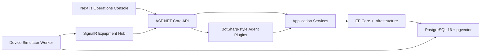

# MES Copilot

MES Copilot is an intelligent manufacturing operations Agent platform for MES data queries, anomaly analysis, quality traceability, SOP/RAG answers, OEE analysis, production reporting, and shop-floor monitoring.

## Architecture



## Stack

- Backend: ASP.NET Core 8, EF Core 8, SignalR
- Agent layer: MES Copilot Agent plugins with structured `FunctionCallResult` output
- Database: PostgreSQL 16 with pgvector
- Frontend: Next.js 14, React 18, TypeScript, Tailwind CSS
- Testing: xUnit, WebApplicationFactory, Vitest, Testing Library
- Deployment: Docker Compose with API, simulator, web, and PostgreSQL services

## Quick Start

```powershell
copy .env.example .env
docker compose up --build
```

Open:

```text
http://localhost:3000
```

API Swagger:

```text
http://localhost:5000/swagger
```

The Phase 1 Compose setup runs the API in `Development` so EF Core migrations and seed data run automatically against the local PostgreSQL container.

## Development Setup

Backend:

```powershell
dotnet restore
dotnet build .\MesCopilot.sln
dotnet test .\MesCopilot.sln
dotnet run --project .\src\MesCopilot.Api
```

Frontend:

```powershell
cd web
pnpm install
pnpm dev
```

Device simulator:

```powershell
dotnet run --project .\src\MesCopilot.DeviceSimulator
```

## Testing

Backend:

```powershell
dotnet build .\MesCopilot.sln --no-restore
dotnet test .\MesCopilot.sln --no-build
dotnet format .\MesCopilot.sln --verify-no-changes --no-restore
```

Frontend:

```powershell
cd web
pnpm lint
pnpm typecheck
pnpm test
pnpm build
```

Coverage baseline:

```powershell
dotnet test .\tests\MesCopilot.UnitTests\MesCopilot.UnitTests.csproj --collect:"XPlat Code Coverage" --settings .\tests\MesCopilot.UnitTests\coverage.runsettings --no-restore
```

## Documentation

- Deployment guide: `docs/deployment-guide.md`
- User manual: `docs/user-manual.md`
- Agent and engineering rules: `docs/ai-rules/`
- OpenAPI contract: `docs/openapi/mescopilot.v1.json`

## Environment

Local defaults are documented in `.env.example`. Do not commit real production credentials, customer data, or private manufacturing data.

## License

License not specified yet.
